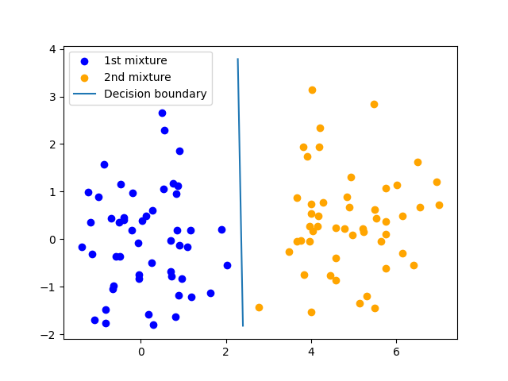
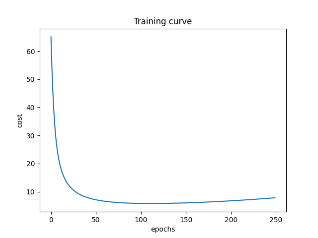

# Bayesian Logistic Regression

This repository contains the code for the implementation of Bayesian Logistic Regression




## How to run
1) Install the Python modules in ```requirements.txt```
2) Run the Jupyter Notebook